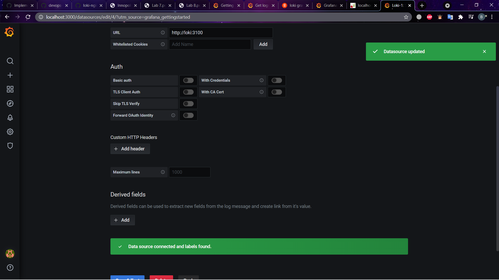
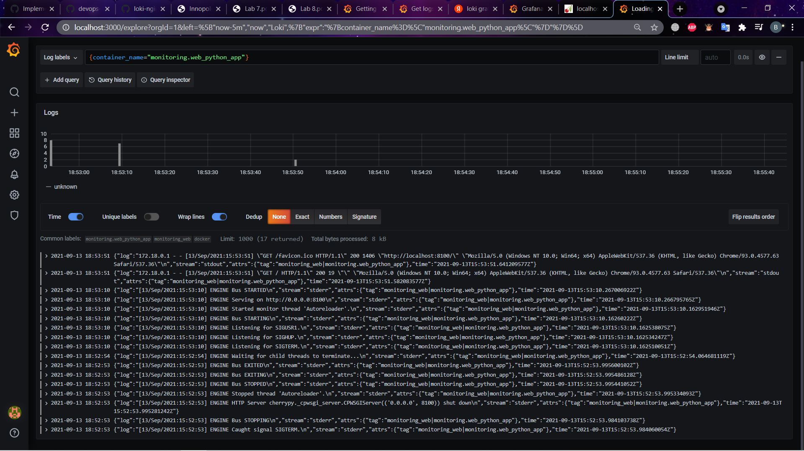

# Logging report

The stack is based on the example: <https://github.com/black-rosary/loki-nginx>.

The stack:

- web - my python app
- grafana - Grafana service <https://grafana.com/grafana/>
- promtail - an agent which ships the contents of local logs to a private Loki instance or Grafana Cloud. <https://grafana.com/docs/loki/latest/clients/promtail/>
- loki - log aggregation system. <https://grafana.com/oss/loki/>

## Report

To launch use docker-compose up

Loki is connected

Logs:

## Best Practices

### Grafana

1. A dashboard should tell a story or answer a question
2. Dashboards should reduce cognitive load, not add to it
3. Strategic observability
4. Have a monitoring strategy
5. Maturity level
6. Use dashboard management maturity model

<https://grafana.com/docs/grafana/latest/best-practices/>

### Loki

1. Static labels are good
2. Label values must always be bounded
3. Use dynamic labels sparingly
4. Configure caching
5. Logs must be in increasing time order per stream

<https://grafana.com/docs/loki/latest/best-practices/>
